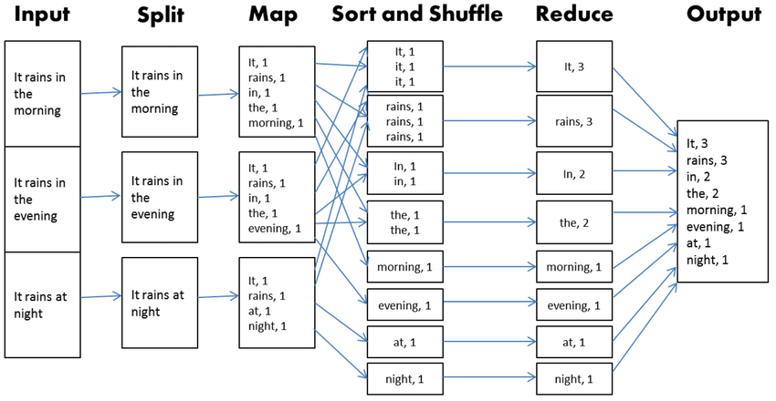

# Distributed processing and the MapReduce framework

## HDFS + YARN architecture

- HDFS: distributed filesystem
- YARN: distributed scheduler and resources manager

## MapReduce: a framework

MapReduce was made to help people write applications that:

- Process vast amounts of data (TB scale)
- On large clusters (thousands of nodes)
- In a reliable, fault-tolerant manner

## MapReduce: Application steps

Input = key/value pairs

1. **Map:** input k/v pairs to intermediate k/v pairs
2. **Shuffle & sort:** dispatch the k/v pairs with the same key to
   the same reduce
3. **Reduce:** set of values which share a key to smaller set of
   values

## MapReduce: Word count example

## MapReduce: Distribution on a cluster

Schema

## MapReduce: Important properties

- Outputs are written to disk between each step
- The number of mappers depends on the number of blocks
- The number of reducers depends on the number of
  workers involved

## MapReduce vs other frameworks

- MapReduce was the ancestor of YARN
- Today, other frameworks that perform better are used:
  - [Apache Tez](https://tez.apache.org/)
  - [Apache Spark](https://spark.apache.org/)
  
---

*The content of this document, including all text, images, and associated materials, is the exclusive property of Adaltas and is protected by applicable copyright laws. Unauthorized distribution, reproduction, or sharing of this content, in whole or in part, is strictly prohibited without the express written consent of the author(s). Any violation of this restriction may result in legal action and the imposition of penalties as prescribed by law.*
