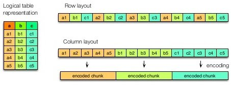

# Data warehousing with Hive

## OLAP vs OLTP

- **OLAP**: OnLine Analytical Processing
  - Process billions of rows in ETL (Extract Transform Load) batch pipelines
  - Join multiple tables
- **OLTP**: OnLine Transactional Processing
  - Read/insert/update a few values the fastest possible

## Hive introduction

- Query data on HDFS using **SQL like language**: HiveQL
- Converts **HiveQL to a DAG of jobs** on YARN
- Works with multiple execution frameworks:
  - MapReduce: disk I/O intensive
  - Tez: uses RAM and can chain reduces
  - (Spark)

## Data querying on HDFS

- Enables to query data **already** on HDFS
- Supports **multiple file formats**:
  - Readable semi-structured (CSV, JSON…)
    ```json
    [
      { "key1": "value1", "key2": "value2" },
      { "key1": "value1", "key2": "value2" }
    ]
    ```
  - Optimized file format (**ORC**, **Parquet**, Avro)
- Can also read data from other systems : HBase, Kafka, PostgreSQL, etc.

## Hive architecture and components

- **HiveServer**
  - Translates HQL to Tez or MR jobs
- **Hive Metastore** (stores data in RDBMS)
  - Stores metadata (table names, schema, data location)
  - Stores statistics on the tables
- **Hive clients** (JDBC). E.g. Beeline


## Example: daily ingestion of CSV file

- Everyday a new CSV file is added on HDFS.
- An external Hive table is created to import the raw data.
  - It points to the folder where the CSV data resides.
  - The CSV records are available in SQL, but it’s not optimal.
- We create a second optimized Hive table, stored in the ORC format.
  - The data resides in another HDFS folder.
  - The CSV data is imported into the optimized table.

## Data file formats

- **Columnar** file formats:
  - Split and compressed by column (binary formats)
  - Embedded statistics on data
  - Embedded schema
  - Exemples: Apache ORC, Apache Parquet
- Exchange file formats: Apache Avro, Protocol Buffers, Apache Arrow



## Hive partitions

- Tables can (**should**) be organized in partitions
- Divide a table into related parts based on the values of particular columns (e.g. **date**, country, etc.)
- Enables to query parts of the data (avoid full scan)
- There should not be to many (small files problem)
- 1 partition = 1 subfolder in HDFS
  - `.../products_table/p_type=book/orc_data`
  - `SELECT avg(price) WHERE p_type = 'book'` => Hive only reads files from the `p_type=book` folder

## Medaillon architecture

- **Bronze**: row integration
- **Silver**: filtered, cleaned, augmented
- **Gold**: business-level aggregates

<figure style="text-align: center">
  
  <figcaption>Medaillon architecture</figcaption>
</figure>

---

*The content of this document, including all text, images, and associated materials, is the exclusive property of Adaltas and is protected by applicable copyright laws. Unauthorized distribution, reproduction, or sharing of this content, in whole or in part, is strictly prohibited without the express written consent of the author(s). Any violation of this restriction may result in legal action and the imposition of penalties as prescribed by law.*
